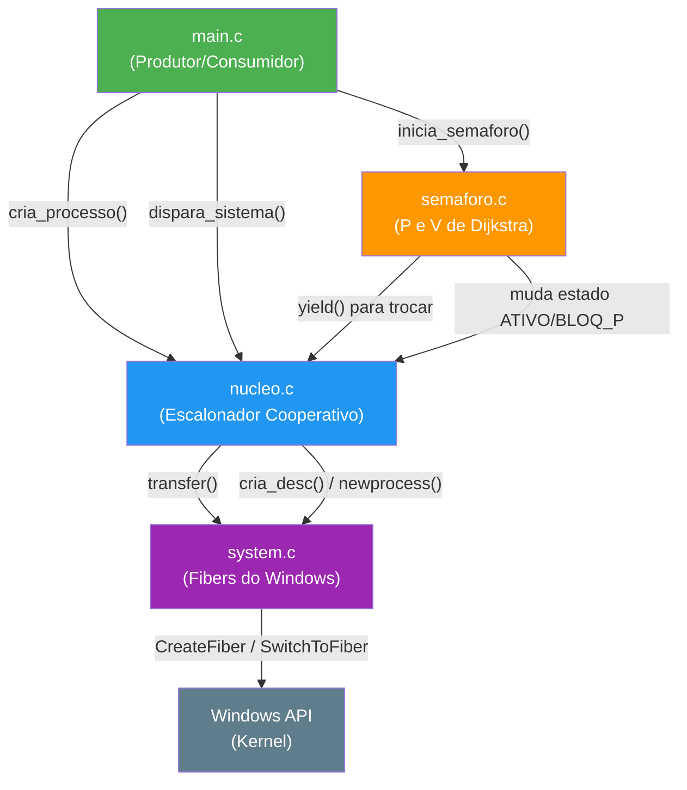

# 🧠 Guia de Estudo — Projeto de Núcleo Multitarefas

> **Disciplina**: Sistemas Operacionais (SIOP) — IFSP Campus Salto  
> **Objetivo**: Criar uma máquina virtual para execução de processos concorrentes com sincronização via semáforos  
> **Linguagem**: C (GCC/MinGW-w64) + API nativa de Fibers do Windows  
> **Grupo**: Dupla (2 alunos)

---

## 📚 Parte 1 — Conteúdos que Vocês Precisam Dominar

### 1.1 Conceito de Multiprogramação e Multitarefa

Multiprogramação é a técnica em que **múltiplos processos compartilham a mesma CPU**, alternando entre si. Imaginem uma cozinha com um único fogão: vários cozinheiros (processos) revezam o fogão (CPU) para preparar seus pratos. Ninguém fica parado esperando, e ninguém fica com o fogão pra sempre — existe um acordo de revezamento.

Neste projeto, a multitarefa é **cooperativa**: cada processo decide voluntariamente quando ceder a CPU (via `yield()`), em vez do sistema operacional arrancar o controle à força (preemptiva).

> [!IMPORTANT]
> Vocês **NÃO** podem usar `pthread`, `thread`, `semaphore` ou qualquer biblioteca de concorrência do sistema. Tudo deve ser construído **do zero** usando Fibers.

---

### 1.2 Co-rotinas e Fibers do Windows

#### O que são Co-rotinas?
São funções que podem **pausar** sua execução no meio e **retomar** exatamente de onde pararam depois. Diferente de uma função normal que roda do início ao fim, uma co-rotina é como um livro com marcador de página: você pode fechar, abrir outro livro, e depois voltar exatamente na página que parou.

#### O que são Fibers?
Fibers são a implementação de co-rotinas no Windows. São unidades de execução **mais leves que threads**:
- **Threads**: o Windows decide quem roda e quando (preemptivo)
- **Fibers**: a **sua aplicação** decide quem roda e quando (cooperativo)

#### Funções da API do Windows que vocês precisam entender

| Função Windows | O que faz | Analogia |
|---|---|---|
| `ConvertThreadToFiber(NULL)` | Transforma a thread do `main` em uma Fiber | "Registrar o gerente como cozinheiro também" |
| `CreateFiber(0, func, arg)` | Cria uma nova Fiber vinculada a uma função | "Contratar um novo cozinheiro e dar a receita dele" |
| `SwitchToFiber(destino)` | Congela a Fiber atual e ativa outra | "Passar a vez no fogão para outro cozinheiro" |

> [!NOTE]
> Vocês **não chamam** essas funções diretamente. O arquivo `system.c` (fornecido pelo professor) já encapsula tudo isso. Vocês usam `system_init_main()`, `cria_desc()`, `newprocess()` e `transfer()`.

---

### 1.3 Troca de Contexto (Context Switch)

Troca de contexto é o ato de **salvar o estado completo** do processo que está rodando (registradores, pilha, ponteiro de instrução) e **restaurar o estado** de outro processo para que ele continue de onde parou.

No projeto, isso é feito pela função `transfer(origem, destino)`:
1. Congela os registradores do processo `origem`
2. Carrega os registradores do processo `destino`
3. A CPU "pula" para a instrução exata onde `destino` tinha parado

É como um "ping-pong" entre funções — cada `transfer` vai e a execução só volta quando alguém fizer outro `transfer` de volta.

---

### 1.4 Fila Circular de Processos (Round-Robin)

O escalonador usa uma **lista ligada circular** para organizar os processos prontos. Imaginem os processos sentados em uma mesa redonda: o escalonador vai passando a vez em ordem, voltando ao primeiro depois do último.

```
  ┌──────────┐    ┌──────────┐    ┌──────────┐
  │ Processo │───►│ Processo │───►│ Processo │──┐
  │    A     │    │    B     │    │    C     │  │
  └──────────┘    └──────────┘    └──────────┘  │
       ▲                                        │
       └────────────────────────────────────────┘
```

Cada nó da fila é um **Descritor de Processo** (PCB), que contém:
- Nome do processo
- Estado (`ATIVO`, `BLOQ_P`, `TERMINADO`)
- Ponteiro para o contexto (Fiber)
- Ponteiro para o próximo descritor

---

### 1.5 Escalonamento Cooperativo vs. Preemptivo

| Aspecto | Cooperativo (nosso projeto) | Preemptivo (Windows/Linux real) |
|---|---|---|
| Quem decide a troca? | O próprio processo via `yield()` | O sistema operacional via interrupção de timer |
| Risco | Um processo mal-comportado trava tudo | Mais resiliente |
| Complexidade | Mais simples (bom pra aprender!) | Mais complexo |
| Quando ocorre a troca? | `yield()`, `P()` com semáforo zerado, ou término | A cada quantum de tempo |

---

### 1.6 Semáforos (Dijkstra)

Semáforo é um mecanismo de **sincronização** inventado por Dijkstra. Pensem num semáforo de trânsito controlando a entrada num estacionamento:

- O **contador `s`** é o número de vagas livres
- A **fila `Q`** é a fila de carros esperando uma vaga

Operações fundamentais:

| Operação | Nome clássico | O que faz |
|---|---|---|
| **P** (Proberen = Testar) | Down / Wait | Se `s > 0`: decrementa e prossegue. Se `s == 0`: **bloqueia** o processo e insere na fila Q |
| **V** (Verhogen = Incrementar) | Up / Signal | Se fila Q está vazia: incrementa `s`. Senão: acorda o primeiro processo da fila Q |

---

### 1.7 Problema Produtor/Consumidor com Buffer Circular

Este é o **teste final** do projeto. Dois processos (Produtor e Consumidor) compartilham um **buffer circular** (array com tamanho fixo):

```
   Buffer Circular (TAM = 5)
   ┌───┬───┬───┬───┬───┐
   │ A │ B │   │   │   │
   └───┴───┴───┴───┴───┘
     ▲               ▲
    out              in
 (consumidor     (produtor
  retira aqui)   insere aqui)
```

**Restrições que os semáforos resolvem:**
1. Produtor **não pode** inserir se o buffer está cheio → semáforo `vazio` (inicia com TAM)
2. Consumidor **não pode** retirar se o buffer está vazio → semáforo `cheio` (inicia com 0)
3. **Exclusão mútua**: apenas um acessa o buffer por vez → semáforo `mutex` (inicia com 1)

---

### 1.8 Exclusão Mútua (Mutex)

É um semáforo **binário** (valor 0 ou 1) que funciona como a chave de um banheiro:
- `P(mutex)` = "Tranquei a porta" (ninguém mais entra)
- `V(mutex)` = "Destranquei a porta" (o próximo pode entrar)

Garante que apenas **um processo por vez** acesse a região crítica (trecho de código que manipula dados compartilhados).

---

### 1.9 Deadlock

Deadlock ocorre quando **todos os processos ficam bloqueados** esperando uns pelos outros, e ninguém consegue prosseguir. No projeto, a função `P()` detecta isso: se, após bloquear o processo atual, não encontrar nenhum outro processo ATIVO na fila, imprime erro e encerra.

---

## 📦 Parte 2 — O Que Vocês Precisam Implementar (Resumo)

### Visão Geral da Arquitetura em Camadas

```
┌─────────────────────────────────────────────┐
│          main.c (Produtor/Consumidor)       │  ← Vocês criam
├─────────────────────────────────────────────┤
│         semaforo.h / semaforo.c             │  ← Vocês criam
├─────────────────────────────────────────────┤
│          nucleo.h / nucleo.c                │  ← Vocês criam
├─────────────────────────────────────────────┤
│         system.h / system.c                 │  ← FORNECIDO (não mexer!)
├─────────────────────────────────────────────┤
│    Windows API (Fibers) + Hardware x86      │  ← Sistema Operacional
└─────────────────────────────────────────────┘
```

> [!IMPORTANT]
> Os arquivos `system.h` e `system.c` são **fornecidos** pelo professor. Vocês usam as funções deles, mas **não os alteram**.

---

### 2.1 Arquivo `nucleo.h` — Interface do Núcleo

Deve conter as declarações (protótipos) de tudo que o núcleo oferece:

#### Estruturas de Dados

```
// ESTRUTURA: ENUM DE ESTADOS DO PROCESSO
// Três estados possíveis para cada processo no escalonador
    // ATIVO     → Processo está pronto para rodar ou está rodando
    // BLOQ_P    → Processo bloqueado esperando um semáforo (operação P)
    // TERMINADO → Processo já finalizou sua execução
```

```
// ESTRUTURA: DESCRITOR DE PROCESSO (PCB - Process Control Block)
// É a "ficha completa" de cada processo no sistema
    // char nome[35]            → Nome legível para debug ("Produtor", "Consumidor")
    // ESTADO_PROC estado       → Estado atual do processo (ATIVO, BLOQ_P, TERMINADO)
    // PTR_DESC contexto        → Ponteiro para o descritor de Fiber (camada system)
    // struct desc_p *fila_sem  → Encadear processo na fila de bloqueados do semáforo
    // struct desc_p *prox_desc → Próximo na fila circular de prontos (Round-Robin)
    // void (*codigo)(void)     → Ponteiro para a função lógica do processo
```

#### Funções que devem ser declaradas

| Função | Responsabilidade |
|---|---|
| `void inicia_fila_prontos(void)` | Inicializa os ponteiros da fila circular (`prim` e `atual` como NULL) |
| `void cria_processo(void (*fn)(void), const char *nome)` | Cria um PCB, vincula à função, insere na fila circular |
| `void dispara_sistema(void)` | Converte o `main` em Fiber e transfere controle ao primeiro processo |
| `void yield(void)` | Processo atual cede a CPU voluntariamente para o próximo ATIVO |
| `void termina_processo(void)` | Marca o processo atual como TERMINADO e cede a CPU |

---

### 2.2 Arquivo `nucleo.c` — Implementação do Núcleo

Aqui entra a implementação real de cada função. Abaixo o **fluxo lógico** de cada uma:

#### Variáveis Globais

```
// VARIÁVEIS GLOBAIS DO NÚCLEO

// PTR_DESC_PROC prim   → Ponteiro para o primeiro elemento da fila circular
// PTR_DESC_PROC atual  → Ponteiro para o processo que está rodando agora

// descritor main_desc  → Descritor de Fiber do main (estático)
// PTR_DESC main_ctx    → Ponteiro para main_desc (para uso no transfer)
// int main_ready       → Flag que indica se o main pode receber controle de volta
```

#### Função `inicia_fila_prontos()`

```
// FLUXO DE INICIA_FILA_PRONTOS

// LIMPAR OS PONTEIROS GLOBAIS DA FILA
    // prim  = NULL
    // atual = NULL
// RESULTADO: Fila circular está limpa e pronta para receber processos
```

#### Função `cria_processo()`

```
// FLUXO DE CRIA_PROCESSO

// ALOCAR MEMÓRIA para um novo DESCRITOR_PROC (malloc)

// PREENCHER OS CAMPOS DO DESCRITOR:
    // Copiar o nome recebido (strncpy)
    // Estado = ATIVO
    // Guardar ponteiro da função do usuário no campo 'codigo'
    // fila_sem = NULL (não está bloqueado em nenhum semáforo)

// CRIAR DESCRITOR DE CONTEXTO FÍSICO (cria_desc do system.h)

// VINCULAR A FIBER AO TRAMPOLIM:
    // newprocess(processo_trampolim, novo_descritor, contexto)
    // OBS: Não vincula diretamente a função do usuário! Vincula o trampolim,
    //      que por sua vez chamará a função do usuário.

// INSERIR NA FILA CIRCULAR DE PRONTOS:
    // SE fila vazia (prim == NULL):
        // prim = novo; novo->prox_desc = novo (aponta pra si mesmo)
    // SENÃO:
        // Percorrer até o último (cujo prox_desc == prim)
        // ultimo->prox_desc = novo; novo->prox_desc = prim

// RESULTADO: Processo criado e inserido na fila pronto para ser escalonado
```

#### Função `processo_trampolim()` (estática/interna)

```
// FLUXO DO TRAMPOLIM

// ENTRADA: void *arg (ponteiro genérico para o descritor do processo)

// CONVERTER arg para PTR_DESC_PROC

// VALIDAR se o descritor e o ponteiro de código são válidos

// EXECUTAR a função do usuário: descritor->codigo()
    // Quando a função terminar naturalmente (return implícito)...

// CHAMAR termina_processo()
    // Garante que o processo seja marcado como TERMINADO
    // e a CPU seja passada para o próximo

// RESULTADO: Rede de segurança — se o usuário não chamou termina_processo,
//            o trampolim chama automaticamente
```

#### Função `proximo_ativo_depois()` (estática/interna)

```
// FLUXO DE PROXIMO_ATIVO_DEPOIS

// ENTRADA: PTR_DESC_PROC a_partir (ponto de partida da busca)

// VERIFICAR se a fila existe (prim != NULL)

// SE a_partir for NULL → usar prim como referência

// INICIAR BUSCA a partir do próximo (a_partir->prox_desc)

// PERCORRER A FILA CIRCULAR:
    // ENQUANTO não voltar ao ponto de partida:
        // SE estado do candidato == ATIVO → RETORNAR esse candidato
        // SENÃO → avançar para o próximo (prox_desc)

// VERIFICAR se o próprio ponto de partida está ATIVO
    // SIM → retornar ele mesmo
    // NÃO → retornar NULL (ninguém está ativo)

// RESULTADO: Próximo processo apto a rodar, ou NULL se nenhum existir
```

#### Função `dispara_sistema()`

```
// FLUXO DE DISPARA_SISTEMA

// VERIFICAR se existem processos na fila (prim != NULL)
    // SE não existem → retornar sem fazer nada

// INICIALIZAR O MAIN COMO FIBER:
    // system_init_main(main_ctx)
    // main_ready = 1

// SELECIONAR PRIMEIRO PROCESSO:
    // SE prim está ATIVO → atual = prim
    // SENÃO → atual = proximo_ativo_depois(prim)

// VALIDAR se encontrou algum processo ativo

// TRANSFERIR CONTROLE:
    // transfer(main_ctx, atual->contexto)
    // A partir daqui, o main fica PAUSADO até todos terminarem

// RESULTADO: Núcleo multitarefa está rodando
```

#### Função `yield()`

```
// FLUXO DE YIELD

// VERIFICAR se existe um processo 'atual'

// BUSCAR próximo ativo: proximo_ativo_depois(atual)

// AVALIAR RESULTADO:
    // SE não achou ninguém OU o próximo é o próprio atual:
        // Retornar sem trocar (continua no mesmo processo)
    // SE achou outro processo:
        // antigo = atual
        // atual = proximo
        // transfer(antigo->contexto, atual->contexto)

// RESULTADO: CPU transferida para o próximo processo ativo
```

#### Função `termina_processo()`

```
// FLUXO DE TERMINA_PROCESSO

// VERIFICAR se existe processo 'atual'

// MARCAR estado do atual como TERMINADO

// BUSCAR próximo ativo: proximo_ativo_depois(atual)

// AVALIAR RESULTADO:
    // SE encontrou outro processo ativo:
        // antigo = atual
        // atual = proximo
        // transfer(antigo->contexto, atual->contexto)
    // SE NÃO encontrou ninguém (todos terminaram):
        // SE main_ready == 1:
            // transfer(atual->contexto, main_ctx)
            // Devolver controle ao programa principal
        // SENÃO:
            // ERRO CRÍTICO: sistema não pode retornar ao main

// RESULTADO: Processo encerrado, CPU transferida para próximo ou para o main
```

---

### 2.3 Arquivo `semaforo.h` — Interface dos Semáforos

```
// ESTRUTURA: SEMÁFORO
    // int s                  → Contador de recursos disponíveis
    // PTR_DESC_PROC Q        → Ponteiro para a fila de processos bloqueados

// FUNÇÕES:
    // void inicia_semaforo(semaforo *sem, int n)  → Inicializa com n recursos
    // void P(semaforo *sem)                       → Solicitar recurso (Down/Wait)
    // void V(semaforo *sem)                       → Liberar recurso (Up/Signal)
```

---

### 2.4 Arquivo `semaforo.c` — Implementação dos Semáforos

#### Função `inicia_semaforo()`

```
// FLUXO DE INICIA_SEMAFORO

// ENTRADA: ponteiro para semáforo, valor inicial n

// VALIDAR ponteiro (se NULL, retornar)

// DEFINIR contador s = n
// LIMPAR fila de bloqueados Q = NULL

// RESULTADO: Semáforo pronto para uso com n recursos disponíveis
```

#### Função `P()` — Down / Wait / Proberen

```
// FLUXO DA OPERAÇÃO P (SOLICITAR RECURSO)

// VALIDAR semáforo e processo atual

// VERIFICAR DISPONIBILIDADE DO RECURSO:
    // SE s > 0:
        // s = s - 1 (decrementa)
        // RETORNAR (processo continua normalmente)

    // SE s == 0 (recurso indisponível):
        // BLOQUEAR o processo atual:
            // atual->estado = BLOQ_P

        // INSERIR no fim da fila Q do semáforo:
            // SE fila vazia: Q = atual
            // SENÃO: percorrer até o fim e encadear via fila_sem

        // VERIFICAR se existe outro processo ATIVO:
            // SE ninguém ativo → DEADLOCK! Encerrar com erro
            // SE alguém ativo → yield() para ceder a CPU

        // Quando acordado pelo V() → processo continua daqui

// RESULTADO: Recurso adquirido, ou processo bloqueado até ser liberado
```

#### Função `V()` — Up / Signal / Verhogen

```
// FLUXO DA OPERAÇÃO V (LIBERAR RECURSO)

// VALIDAR semáforo

// VERIFICAR FILA DE BLOQUEADOS:
    // SE fila Q está vazia:
        // s = s + 1 (incrementa, recurso livre)

    // SE fila Q tem processos esperando:
        // REMOVER o primeiro processo (p) da fila Q
        // p->fila_sem = NULL (limpar encadeamento)
        // p->estado = ATIVO (acordar o processo)

// RESULTADO: Recurso liberado ou processo bloqueado acordado
// NOTA: O processo atual NÃO perde a CPU. Ele continua rodando
//       até chamar yield() ou P() novamente.
```

---

### 2.5 Arquivo `main.c` — Teste Produtor/Consumidor

```
// FLUXO DO PROGRAMA PRINCIPAL (PRODUTOR/CONSUMIDOR)

// DEFINIÇÕES:
    // TAM = tamanho do buffer circular
    // buffer[TAM] = área compartilhada
    // in = 0 (índice de inserção)
    // out = 0 (índice de retirada)
    // Semáforos: cheio, vazio, mutex

// INICIALIZAÇÕES:
    // inicia_fila_prontos()
    // inicia_semaforo(cheio, 0)     → Inicialmente não há itens prontos
    // inicia_semaforo(vazio, TAM)   → Todas as posições estão livres
    // inicia_semaforo(mutex, 1)     → Apenas 1 pode acessar o buffer por vez

// CRIAR PROCESSOS:
    // cria_processo(produtor, "Produtor")
    // cria_processo(consumidor, "Consumidor")

// DISPARAR O SISTEMA:
    // dispara_sistema()

// FIM: quando todos terminarem, controle volta aqui
```

#### Lógica do Produtor

```
// FLUXO DO PRODUTOR

// REPETIR INFINITAMENTE:
    // PRODUZIR uma nova mensagem

    // P(vazio)  → Aguardar slot livre no buffer
    // P(mutex)  → Entrar na região crítica (exclusão mútua)

    // DEPOSITAR mensagem no buffer[in]
    // in = (in + 1) % TAM   → Avançar ponteiro circular

    // V(mutex)  → Sair da região crítica
    // V(cheio)  → Sinalizar que há item pronto para consumo

    // yield()   → Ceder a CPU voluntariamente
```

#### Lógica do Consumidor

```
// FLUXO DO CONSUMIDOR

// REPETIR INFINITAMENTE:
    // P(cheio)  → Aguardar item disponível no buffer
    // P(mutex)  → Entrar na região crítica (exclusão mútua)

    // RETIRAR mensagem do buffer[out]
    // out = (out + 1) % TAM   → Avançar ponteiro circular

    // V(mutex)  → Sair da região crítica
    // V(vazio)  → Sinalizar que há slot livre para produção

    // EXIBIR/CONSUMIR a mensagem retirada

    // yield()   → Ceder a CPU voluntariamente
```

---

## ✅ Parte 3 — Checklist de Entrega

### Arquivos Fornecidos (não alterar)
- [ ] `system.h` — Interface da camada de Fibers
- [ ] `system.c` — Implementação da camada de Fibers

### Arquivos para Criar

#### Núcleo Multitarefas
- [ ] `nucleo.h` — Declaração de tipos (`ESTADO_PROC`, `DESCRITOR_PROC`) e protótipos
- [ ] `nucleo.c` — Implementação das funções:
  - [ ] `inicia_fila_prontos()`
  - [ ] `cria_processo()`
  - [ ] `processo_trampolim()` (estática)
  - [ ] `proximo_ativo_depois()` (estática)
  - [ ] `dispara_sistema()`
  - [ ] `yield()`
  - [ ] `termina_processo()`

#### Semáforos
- [ ] `semaforo.h` — Declaração da struct `semaforo` e protótipos
- [ ] `semaforo.c` — Implementação das funções:
  - [ ] `inicia_semaforo()`
  - [ ] `P()` (Down/Wait)
  - [ ] `V()` (Up/Signal)

#### Aplicação de Teste
- [ ] `main.c` — Programa principal com Produtor/Consumidor:
  - [ ] Buffer circular com TAM posições
  - [ ] Funções `depositar()` e `retirar()`
  - [ ] Processo `produtor()`
  - [ ] Processo `consumidor()`
  - [ ] Inicialização de semáforos e disparo do sistema

### Testes de Validação
- [ ] **Teste 1 — Núcleo Básico**: Dois processos simples imprimindo e cedendo CPU (`yield`)
- [ ] **Teste 2 — Término**: Processos que terminam naturalmente e o sistema volta ao `main`
- [ ] **Teste 3 — Produtor/Consumidor**: Teste completo com semáforos e buffer circular

---

## 🔑 Parte 4 — Dicas Importantes

> [!TIP]
> **Ordem de implementação recomendada:**
> 1. Primeiro faça o `nucleo.h` e `nucleo.c` **sem** semáforos
> 2. Teste com processos simples (imprimir e `yield`)
> 3. Depois implemente `semaforo.h` e `semaforo.c`
> 4. Por último, faça o `main.c` com Produtor/Consumidor

> [!WARNING]
> **Erros comuns:**
> - Esquecer de chamar `system_init_main()` antes do primeiro `transfer` → **CRASH**
> - Não fazer a fila ser **circular** (último apontando para o primeiro) → escalonador trava
> - Na operação `P`, bloquear sem verificar deadlock → programa congela sem mensagem de erro
> - Esquecer de chamar `yield()` dentro dos loops dos processos → um processo monopoliza a CPU

> [!CAUTION]
> **Sobre a compilação:**
> - Usem MinGW-w64 (GCC para Windows)
> - Compilem com: `gcc -o projeto main.c nucleo.c semaforo.c system.c`
> - O código depende da API Windows, então **só roda no Windows**

---

## 🗺️ Parte 5 — Mapa Mental da Arquitetura



---

## 📖 Parte 6 — Glossário Rápido

| Termo | Significado |
|---|---|
| **PCB** | Process Control Block — a "ficha" de cada processo |
| **Fiber** | Unidade de execução leve do Windows, trocada manualmente |
| **Round-Robin** | Algoritmo de escalonamento circular: cada um roda na sua vez |
| **yield()** | "Eu cedo minha vez voluntariamente" |
| **P()** | "Quero usar o recurso" (pode bloquear se não tiver) |
| **V()** | "Terminei de usar o recurso" (pode acordar quem esperava) |
| **Mutex** | Semáforo binário (0 ou 1) para exclusão mútua |
| **Deadlock** | Todos bloqueados, ninguém consegue prosseguir |
| **Buffer Circular** | Array que "dá a volta": índice = (índice + 1) % TAM |
| **Trampolim** | Função intermediária que executa o código do usuário e garante cleanup |
| **Região Crítica** | Trecho de código que só pode ser executado por um processo de cada vez |
